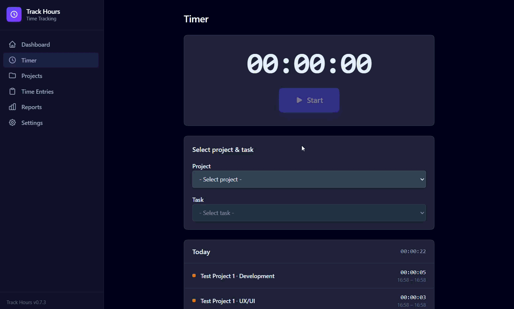

<p align="center">
  
</p>

<h1 align="center">Track Hours</h1>

A modern, offline-first desktop application for tracking time across projects and tasks.

Whether you are a freelancer, developer, or anyone who needs to keep track of how their time is spent, **Track Hours** gives you a clean and distraction-free environment to log, review, and export your work hours — without any cloud dependency.

| Timer                           | Project                              |
| ------------------------------- | ------------------------------------ |
|  |  |

---

## Features

- **Projects & Tasks** — Create, edit, and archive projects and tasks with custom colors and categories (Development, Design, Meeting, Testing, Management, Research, and more)
- **Live Timer** — Start/stop real-time tracking with desktop notifications
- **Manual Entries** — Add or edit time entries retroactively with start time, end time, and notes
- **Day / Week / Month View** — Browse entries with filters by project, category, and full-text search
- **Reports** — Visual breakdowns of tracked time per project and category with bar charts
- **Export** — Export to CSV (UTF-8 BOM for Excel compatibility) or PDF
- **Reminders** — Configurable desktop notifications reminding you to log your time
- **Offline-first** — All data is stored locally; no account or internet connection required
- **Themes & i18n** — Dark/light theme, English and German interface
- **Auto-Update** — Automatic updates via GitHub releases (Electron)

---

## Quick Start

```bash
npm install
npm run electron:dev
```

This installs dependencies and launches the app as a desktop window (Angular dev server + Electron).

> Prefer the browser? Run `npm start` and open [http://localhost:4200](http://localhost:4200).

Full setup, scripts, and troubleshooting: **[Getting Started](docs/getting-started.md)**

---

## Download

Pre-built installers are available for **Windows** and **Linux** via the [GitHub Releases page](https://github.com/realdeepnull/track-hours/releases).

| Platform | Artifact                      |
| -------- | ----------------------------- |
| Windows  | `Track-Hours-Setup-x.x.x.exe` |
| Linux    | `Track-Hours-x.x.x.AppImage`  |

> macOS builds are not currently provided.

---

## Tech Stack

| Layer          | Technology                           |
| -------------- | ------------------------------------ |
| Frontend       | Angular 22, TypeScript, Tailwind CSS |
| Desktop shell  | Electron 43                          |
| State          | Angular Signals                      |
| Translations   | @ngx-translate                       |
| Date utilities | date-fns                             |
| PDF export     | jsPDF + jspdf-autotable              |
| CSV export     | PapaParse                            |
| Packaging      | electron-builder                     |
| Testing        | Vitest                               |
| Linting        | ESLint + angular-eslint              |

---

## Documentation

All documentation lives in the [`docs/`](docs) folder:

| Document                                   | Audience           | Contents                                                                |
| ------------------------------------------ | ------------------ | ----------------------------------------------------------------------- |
| [Getting Started](docs/getting-started.md) | Everyone           | Prerequisites, installation, running, building, available scripts       |
| [Development Guide](docs/development.md)   | Developers         | Architecture, project structure, state management, Electron IPC, models |
| [Contributing](docs/contributing.md)       | Contributors       | Workflow, commit conventions, code style, testing, releases             |
| [Data Storage](docs/data-storage.md)       | Developers / Users | Persistence model, file locations, export pipeline                      |

---

## Project Structure

```
src/app/
  models/            # Data models: Project, Task, TimeEntry, AppSettings
  services/          # StorageService, ProjectService, TimeEntryService,
                     #   TimerService, ExportService, UpdateService
  shared/            # DurationPipe, IconComponent
  components/        # Sidebar, UpdateBanner
  pages/             # Dashboard, Timer, Projects, Entries, Reports, Settings
electron/
  main.js           # Electron main process (window, IPC, auto-updater)
  preload.js         # Context bridge (secure IPC API)
public/
  i18n/             # Translation files (de.json, en.json)
docs/               # Project documentation
```

See the [Development Guide](docs/development.md) for the full architecture breakdown.

---

## Data Storage

Track Hours is offline-first. In Electron mode, data is persisted as JSON files in the OS user data directory; in browser mode, data uses `localStorage`.

| Platform | Path                                                          |
| -------- | ------------------------------------------------------------- |
| Windows  | `%APPDATA%\track-hours\track-hours-data\`                     |
| macOS    | `~/Library/Application Support/track-hours/track-hours-data/` |
| Linux    | `~/.config/track-hours/track-hours-data/`                     |

Details: **[Data Storage](docs/data-storage.md)**

---

## Contributing

Contributions, issues, and feature requests are welcome. This project follows [Conventional Commits](https://www.conventionalcommits.org/), and releases are automated via [Release Please](https://github.com/googleapis/release-please).

```bash
git checkout -b feat/my-feature
npm run lint
npm test
```

Full workflow, code style, and conventions: **[Contributing](docs/CONTRIBUTING.md)**

---

## License

This project is licensed under the **MIT License (Non-Commercial)** — see the [LICENSE](LICENSE) file for details.
